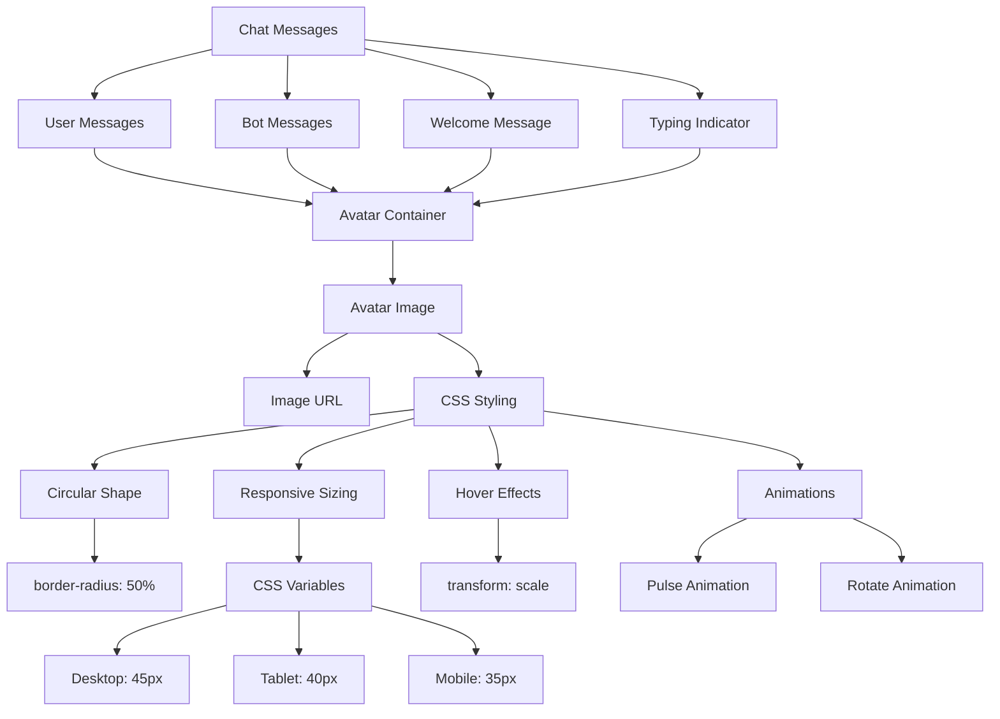

```mermaid
graph TD
    A[Chat Messages] --> B[User Messages]
    A --> C[Bot Messages]
    A --> D[Welcome Message]
    A --> E[Typing Indicator]
    
    B --> F[Avatar Container]
    C --> F
    D --> F
    E --> F
    
    F --> G[Avatar Image]
    G --> H[Image URL]
    G --> I[CSS Styling]
    
    I --> J[Circular Shape]
    I --> K[Responsive Sizing]
    I --> L[Hover Effects]
    I --> M[Animations]
    
    J --> N[border-radius: 50%]
    K --> O[CSS Variables]
    L --> P[transform: scale]
    M --> Q[Pulse Animation]
    M --> R[Rotate Animation]
    
    O --> S[Desktop: 45px]
    O --> T[Tablet: 40px]
    O --> U[Mobile: 35px]
```