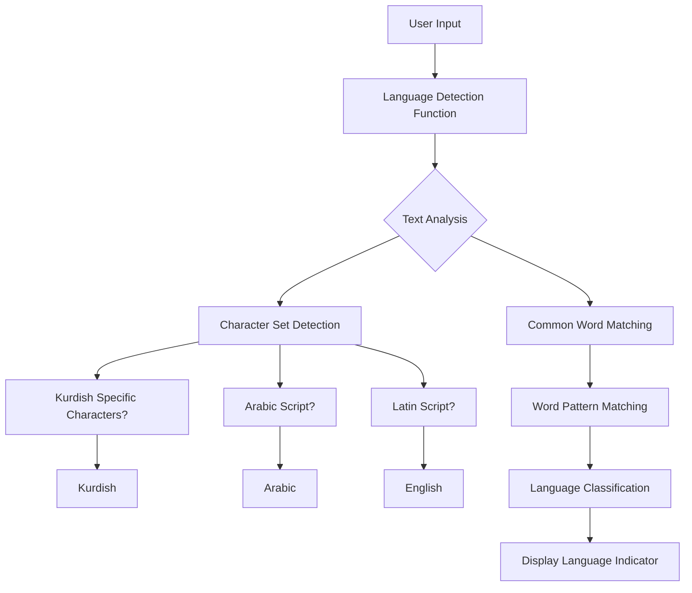

```mermaid
graph TD
    A[User Input] --> B[Language Detection Function]
    B --> C{Text Analysis}
    C --> D[Character Set Detection]
    C --> E[Common Word Matching]
    D --> F[Kurdish Specific Characters?]
    D --> G[Arabic Script?]
    D --> H[Latin Script?]
    F --> I[Kurdish]
    G --> J[Arabic]
    H --> K[English]
    E --> L[Word Pattern Matching]
    L --> M[Language Classification]
    M --> N[Display Language Indicator]
```